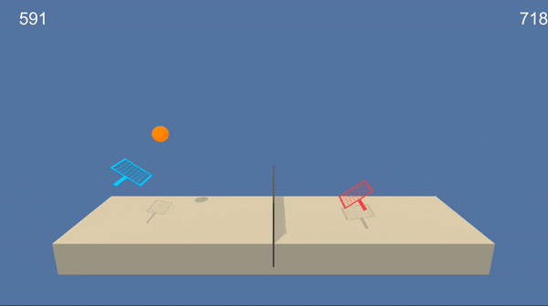

# Project 3 - Collaboration and Competition - Deep Reinforcement Learning Nanodegree

### Introduction

In this project, we use deep reinforcement learning in a multi agent setting to train agents to play tennis in a Unity environment.



### Setup

#### Download and install deepRL-multi-agent
```
clone git https://github.com/clzuend/deepRL-multi-agent.git
cd deepRL-multi-agent
pip install .
```

#### Download the Unity Tennis Environment
1. Download the environment from one of the links below.  You need only select the environment that matches your operating system:
    - Linux: [click here](https://s3-us-west-1.amazonaws.com/udacity-drlnd/P3/Tennis/Tennis_Linux.zip)
    - Mac OSX: [click here](https://s3-us-west-1.amazonaws.com/udacity-drlnd/P3/Tennis/Tennis.app.zip)
    - Windows (32-bit): [click here](https://s3-us-west-1.amazonaws.com/udacity-drlnd/P3/Tennis/Tennis_Windows_x86.zip)
    - Windows (64-bit): [click here](https://s3-us-west-1.amazonaws.com/udacity-drlnd/P3/Tennis/Tennis_Windows_x86_64.zip)

2. Place the file in the project folder. 

3. Depending on your operating system you might have to change the ``TENNIS_PATH`` in  `Multi-Agent-Tennis.ipynb`. 

### Instructions

Open the `Multi-Agent-Tennis.ipynb` workbook to initiate the environment and train the agents.

If one agent object is passed to the training function, the network will be trained jointly for both agents:

```python
agent = Agent(state_size=state_size, action_size=action_size, random_seed=0)
train()
```

If a second agent object is passed to ``agent2``, the agents will be trained separately:

```python
agent1 = Agent(state_size=state_size, action_size=action_size, random_seed=0)
agent2 = Agent(state_size=state_size, action_size=action_size, random_seed=1)
train(agent1, agent2)
```

Additional information can be found in the project report: `Report.pdf`
